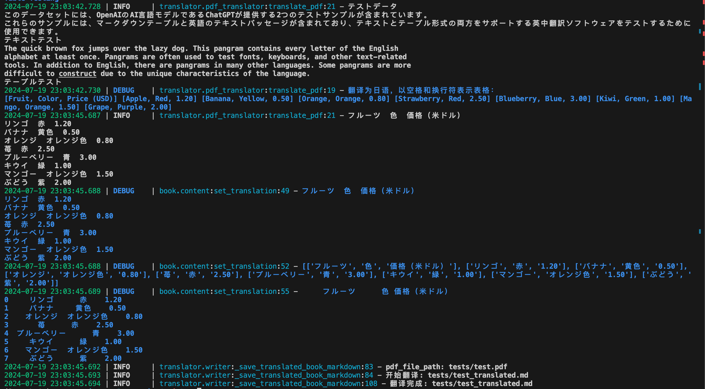
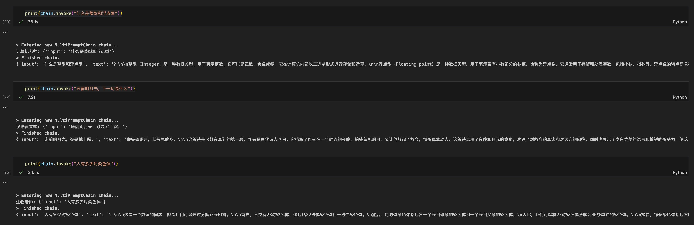

## Homework 

### 1.GPT-4V:手写图片读取 


```
图中展示的是一个办公室。一位男士背对着镜头站在白板前，白板上写着“二营长，我意大利炮呢”，这句话是电视剧《亮剑》中的一句台词，男子可能想用这句话来指代自己想要做某件事。整个画面给人一种幽默、搞笑的感觉。
```

### 2.openai-translator



テストデータ
このデータセットには、OpenAIのAI言語モデルであるChatGPTが提供する2つのテストサンプルが含まれています。
これらのサンプルには、マークダウンテーブルと英語のテキストパッセージが含まれており、テキストとテーブル形式の両方をサポートする英中翻訳ソフトウェアをテストするために使用できます。
テキストテスト
The quick brown fox jumps over the lazy dog. This pangram contains every letter of the English
alphabet at least once. Pangrams are often used to test fonts, keyboards, and other text-related
tools. In addition to English, there are pangrams in many other languages. Some pangrams are more
difficult to construct due to the unique characteristics of the language.
テーブルテスト

| フルーツ | 色 | 価格（米ドル） |
| --- | --- | --- |
| リンゴ | 赤 | 1.20 |
| バナナ | 黄色 | 0.50 |
| オレンジ | オレンジ色 | 0.80 |
| 苺 | 赤 | 2.50 |
| ブルーベリー | 青 | 3.00 |
| キウイ | 緑 | 1.00 |
| マンゴー | オレンジ色 | 1.50 |
| ぶどう | 紫 | 2.00 |

---

### 3.router-chain 扩展老师
